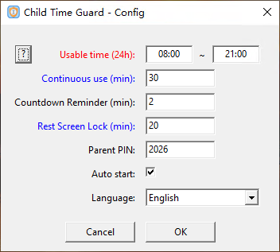
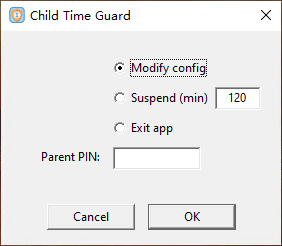
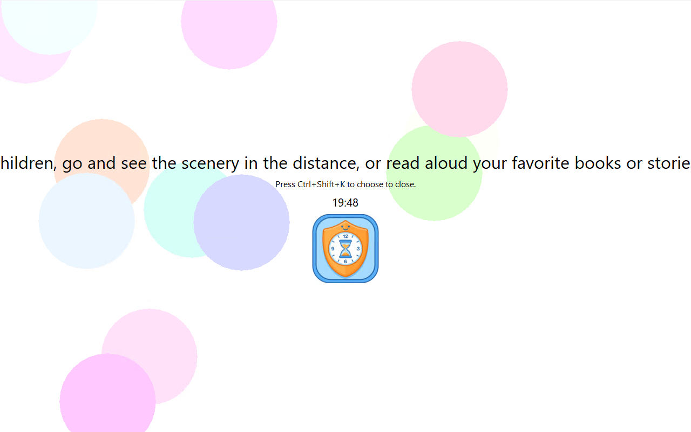
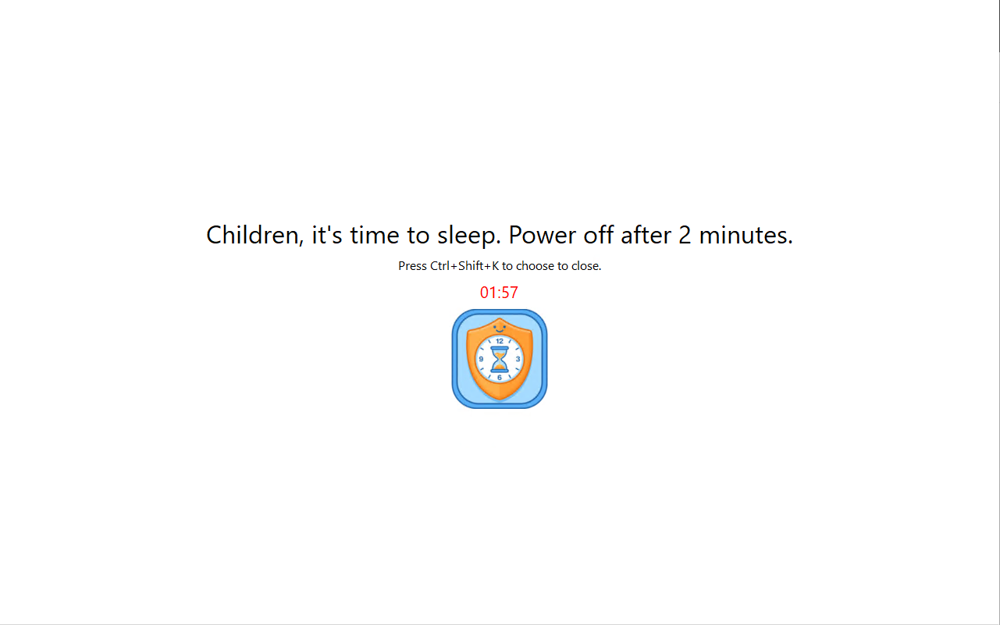

Language support: [简体中文](https://blog.t725.cn/ChildTimeGuard/), English. For other languages, please edit the `%AppData%ChildTimeGuardlanguage.json` file yourself.

Developed using Vibe Coding to help children at home use the computer for entertainment in a regular manner. 

A single file of 331K, no installation required, just double-click to use. Runs using only 1M of memory, system requirements:

1. Windows 10/11 x64, other versions not tested.
2. Requires VC 14 runtime support. If not installed, please download and install [Visual C Redistributable v14 x64](https://aka.ms/vc14/vc_redist.x64.exe).
3. Supports standard Windows users, no administrator permissions needed.

The first time you use it, the configuration interface will open automatically. Configure three parameters including available time periods. Within the available time period, after turning on the computer, every "usage duration" period will be followed by a forced "rest/lock screen" period before continuing to use. Outside of the available time period, the screen will automatically lock and start counting down to shutdown.

During the lock screen period, all application windows are blocked; after the lock ends, everything returns to the previous state.

At any time, parents can press `Ctrl+Shift+K` to open the control dialog, enter the password (default is 2026), and manage the application, such as: modifying configuration, temporarily disabling, or exiting the application.

